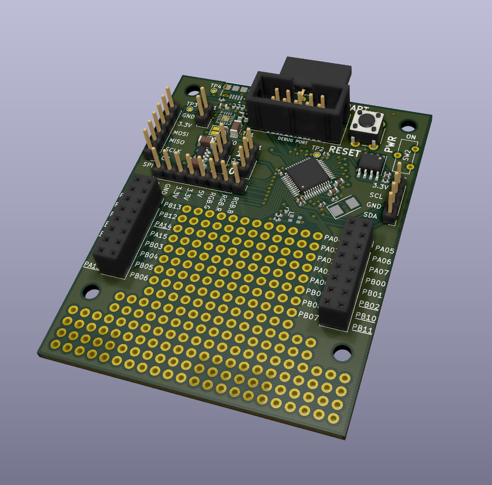

# Termite Devboard

Termite is an open source hardware devboard aimed at embedded library developers.

## Features
  * An stm32f103 cortex m3 microcontroller.
  * A protoboard space to mount components on.
  * An RGB led.
  * Support for lithium ion batteries as power source.
  * Charging of lithium ion batteries.
  * 128Kb of external onboard flash memory

## The idea
The idea came from my teacher who is developing multiple embedded libraries.
These libraries have support for many different types of displays, sensors, etc.
Everytime a change is made to the library my teacher had to hookup the sensors to an devboard. 
His wish was to have a devboard cheap enough he could solder the components on and leave them on.
This is what termite was designed for.

## Power
The board can be powered by 5v or 3.3 volt. 
There is a usb connector which can be used for power as well. 
Another option is to connect a lithium ion battery. 
If there is a voltage on the 5v rail a connected battery will be charged.

### WARNINGS about battery usage: 
  1. Only connect lithium ion batteries with a voltage of 3.7V marked on them.
  2. Don't connect batteries with a capacity less than 250mAh.
  3. Only connect batteries with an integrated protection circuit.
  4. Don't charge your board unattended. 

### Status leds:

| Green led  | Red led | Meaning |
| ------------- | ------------- | ------------- |
| Off  | Off  | No external power connected.
| On  | Off  | External power connected, battery full or not connected.
| On  | On  | External power connected, battery charging
| On  | Blinking  | External power connected, issue with battery detected.

## Flashing the microcontroller
The board include an IDC header that matches the pinout of the stlink-v2.
You need an IDC cable to connect between the flash tool and the board. 
After that it flashes just as any other stm microcontroller.

## Opening the files
To open the design files you need kicad. 
It's free software so you can just download it.

## Producing a board
If you want to produce a board you can export all the needed files from kicad.
It is hard (read impossible) to solder the battery charging chip with a normal soldering iron.
So if you want the battery charging you need to arrange for better equipment or arrange for pick and placing the board.

The board is 4 layer and can be produced by almost every common pcb factory.

If there are any problems I'm happy to help you on your way.
Just contact me!

## Testing the board
After production a testing script is available to check if the board is functioning oke. 
You can find the script and it's docs [here](https://github.com/CvRXX/termite-test-firmware).

## Examples with the termite board.
  * [A temperature sensor for painting scouting boats.](https://github.com/CvRXX/termite-demo)